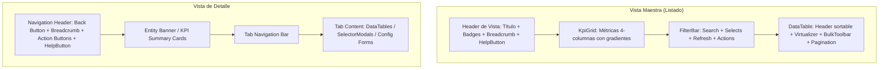

# Manual de Estilo y Guía de Arquitectura UI — Moodle Adminer

Este documento define los estándares visuales, tokens de diseño, patrones de componentes y lineamientos de arquitectura frontend para **Moodle Adminer**. Su objetivo es garantizar la consistencia visual y de experiencia de usuario (UX) cada vez que se agreguen, modifiquen o refactoricen vistas en el proyecto.

---

## 1. Principios de Diseño y Filosofía Visual

Moodle Adminer está diseñado bajo el concepto de **"Modern Management Studio"**:
- **Densidad de Información Óptima:** Interfaces limpias y profesionales con espaciado balanceado (`gap-4` a `gap-6`), diseñadas para administradores y gestores que necesitan visualizar métricas y listas densas sin sobrecarga cognitiva.
- **Glassmorphism y Elevaciones Sutiles:** Fondos con efecto de desenfoque (`bg-card/60 backdrop-blur-md`, `.glass-panel`), bordes semitransparentes (`border-border/70` o `border-border/80`) y sombras suaves (`shadow-sm`, `shadow-md`, `shadow-xl`).
- **Dark Mode y Multi-Tenant Nativo:** Todo componente utiliza tokens semánticos HSL de CSS variables compatibles con modo claro, oscuro (`dark`) y cyberpunk, así como personalización dinámica por tenant (`src/config/tenant.js`).
- **Micro-interacciones y Feedback Inmediato:** Transiciones fluidas (`transition-all duration-200`), estados de pulsación activa (`active:scale-[0.98]`), indicadores de carga unificados (`Loader2 animate-spin`) y notificaciones flotantes contextuales (`ToastProvider`).

---

## 2. Tokens de Diseño y Variables CSS

Toda la aplicación se apoya en Tailwind CSS y variables HSL definidas en `src/index.css` y `tailwind.config.js`. **Nunca usar colores hexadecimales o clases arbitrarias si existe un token semántico.**

### 2.1. Paleta de Colores Semántica
| Token | Variable CSS | Uso Principal |
| :--- | :--- | :--- |
| `bg-background` / `text-foreground` | `--background`, `--foreground` | Fondo general y color base de texto del viewport. |
| `bg-card` / `text-card-foreground` | `--card`, `--card-foreground` | Superficies de contenedores, tarjetas, modales y tablas. |
| `bg-primary` / `text-primary-foreground` | `--primary`, `--primary-foreground` | Botones principales, enlaces activos, selecciones y acentos primarios (`#2563eb` / azul real moderno). |
| `bg-secondary` / `text-secondary-foreground` | `--secondary`, `--secondary-foreground` | Botones secundarios, filtros neutros y fondos auxiliares. |
| `bg-muted` / `text-muted-foreground` | `--muted`, `--muted-foreground` | Textos secundarios, placeholders, bordes atenuados y tracks de progreso. |
| `bg-accent` / `text-accent-foreground` | `--accent`, `--accent-foreground` | Efectos hover sobre filas de tablas, items de menú y dropdowns. |
| `bg-destructive` / `text-destructive-foreground` | `--destructive`, `--destructive-foreground` | Acciones de borrado, desvinculación, errores y alertas críticas. |
| `border-border` / `border-input` | `--border`, `--input` | Bordes estándar de tarjetas, separadores y campos de formulario. |

### 2.2. Tipografía y Jerarquía
- **Fuente Principal:** `Plus Jakarta Sans` (`--font-sans`).
- **Fuente Monoespaciada:** `JetBrains Mono` (`--font-mono`) para IDs técnicos, códigos cortos (`shortname`), slugs y números de identificación (`idnumber`).

| Nivel | Clases Tailwind recomendadas | Casos de Uso |
| :--- | :--- | :--- |
| **H1 (Título de Vista)** | `text-2xl font-black tracking-tight text-foreground` | Encabezado principal de la vista activa. |
| **H2 (Título de Modal/Sección)** | `text-lg font-bold tracking-tight text-foreground` | Títulos de Dialog, tarjetas principales o secciones. |
| **H3 (Subtítulo/Card Header)** | `text-base font-semibold text-foreground` | Títulos internos de pestañas o grupos de datos. |
| **KPI Metric Value** | `text-3xl font-extrabold tracking-tight text-foreground` | Valor numérico central en tarjetas KPI. |
| **Label / Caption / Badge** | `text-xs font-semibold tracking-wider uppercase text-muted-foreground` | Encabezados de tabla, etiquetas KPI y metadata. |
| **Body / Tabla standard** | `text-sm font-normal text-foreground` | Filas de datos, inputs y descripciones estándar. |

### 2.3. Radios y Bordes
- Componentes grandes (Tarjetas, Paneles, Modales, Contenedores de Tablas): `rounded-2xl` (1rem).
- Componentes medianos (Cards estándar, Dropdowns, Popovers): `rounded-xl` (0.75rem).
- Componentes interactivos (Botones, Inputs, Selects): `rounded-lg` (0.5rem).
- Badges e indicadores de estado: `rounded-full` con padding horizontal `px-2.5 py-0.5`.

---

## 3. Estructura Estándar de Vistas (Layout Anatomy)

Todas las vistas de la aplicación deben respetar una de las dos estructuras canónicas: **Vista Maestra (Listado/Dashboard)** o **Vista de Detalle**.



### 3.1. Vista Maestra (Listing View)
1. **Header de Página:**
   ```jsx
   <div className="flex flex-col sm:flex-row sm:items-center justify-between gap-4 mb-6">
     <div className="space-y-1">
       <div className="flex items-center gap-3">
         <h1 className="text-2xl font-black tracking-tight text-foreground">{title}</h1>
         <Badge variant="secondary">{totalCount} registros</Badge>
         <HelpTooltip text="Explicación concisa de la vista" viewId="vista-id" />
       </div>
       <p className="text-sm text-muted-foreground">{description}</p>
     </div>
     <div className="flex items-center gap-2">
       {/* Acciones principales de cabecera si aplican */}
     </div>
   </div>
   ```

2. **Métricas KPI (`KpiGrid`):**
   - Siempre ubicado antes de la tabla de datos.
   - 4 columnas responsivas (`grid-cols-1 sm:grid-cols-2 lg:grid-cols-4`).
   - Cada KPI incluye: `title`, `value`, `icon`, `color` (gradiente CSS como `from-blue-600 to-indigo-600`), `badgeColor`, `progress` (opcional) y `details` (array con subtotales/tendencias).

3. **Barra de Filtros y Acciones (`FilterBar`):**
   - Búsqueda con debounce de 300ms y botón de limpieza automática `X`.
   - Filtros dropdown tipados (siempre suministrar `id` único obligatorio a cada filtro).
   - Acciones integradas: `primaryAction` (Crear/Agregar), `secondaryAction` (Subir CSV, etc.), `onExportCsv` y `onRefresh`.

4. **Tabla de Datos (`DataTable`):**
   - Ordenación en servidor/local con indicadores `ChevronUp` / `ChevronDown`.
   - Filtros individuales por columna (popovers tipo `select` o `text`).
   - Barra flotante de acciones por lote (`DataTableToolbar`) cuando hay filas seleccionadas.
   - Paginación estándar (`DataTablePagination`) con tamaño de página configurable.
   - Estado vacío estilizado con icono `Inbox` y mensaje contextual.

### 3.2. Vista de Detalle (Detail View)
1. **Barra de Navegación Superior:**
   - Botón `ArrowLeft` con variante `outline` o `ghost` para retorno seguro a la vista padre.
   - Breadcrumbs legibles: `Cursos / [Nombre del Curso]`.
   - Badges de estado inmediatos (ej. `Visible` / `Oculto`, `Activo` / `Suspendido`).
2. **Pestañas de Navegación (Tabs):**
   - Pestañas con estilo pastilla (`inline-flex p-1 bg-muted/60 rounded-xl border border-border/50`).
   - Pestaña activa: `bg-card text-foreground shadow-xs font-semibold`.
   - Pestaña inactiva: `text-muted-foreground hover:text-foreground`.
   - Conteo numérico en badge adjunto a cada pestaña.
3. **Modales de Vinculación (`SelectorModal`):**
   - Usar `SelectorModal` con buscador interno, selector masivo y paginación para vincular entidades (Cohortes, Usuarios, Cursos, Competencias).

---

## 4. Catálogo de Componentes Reutilizables y Esquemas de Props

### 4.1. `Button` (`src/components/ui/Button.jsx`)
| Variante (`variant`) | Clases Principales | Propósito |
| :--- | :--- | :--- |
| `default` | `bg-primary text-primary-foreground hover:bg-primary/90` | Acción principal (Guardar, Crear, Confirmar). |
| `destructive` | `bg-destructive text-destructive-foreground hover:bg-destructive/90` | Acciones irreversibles (Eliminar, Suspender, Desvincular). |
| `outline` | `border border-input bg-background hover:bg-accent` | Botones secundarios, exportar, filtros, volver. |
| `secondary` | `bg-secondary text-secondary-foreground hover:bg-secondary/80` | Acciones neutrales o filtros. |
| `ghost` | `hover:bg-accent hover:text-accent-foreground` | Botones de iconos, cerrar modales, dropdown triggers. |
| `success` | `bg-emerald-600 text-white hover:bg-emerald-700` | Acciones positivas explícitas (Activar, Completar). |
| `warning` | `bg-amber-500 text-white hover:bg-amber-600` | Acciones preventivas (Ocultar, Desactivar). |

*Tamaños disponibles (`size`):* `sm` (h-8), `default` (h-10), `lg` (h-11), `icon` (h-9 w-9 o h-10 w-10).

### 4.2. `Badge` (`src/components/ui/Badge.jsx`)
| Variante (`variant`) | Estilo Semántico | Ejemplo de Uso |
| :--- | :--- | :--- |
| `success` | `bg-emerald-500/10 text-emerald-600 dark:text-emerald-400 border-emerald-500/20` | Visible, Activo, Completado, Competente. |
| `warning` | `bg-amber-500/10 text-amber-600 dark:text-amber-400 border-amber-500/20` | Oculto, Pendiente de Revisión, En progreso. |
| `destructive` | `bg-destructive/10 text-destructive border-destructive/20` | Suspendido, Eliminado, No competente. |
| `info` | `bg-sky-500/10 text-sky-600 dark:text-sky-400 border-sky-500/20` | Categoría, Rol profesor, Tipo de escala. |
| `secondary` / `outline` | `bg-secondary text-secondary-foreground` | Conteo de items, ID, versiones, etiquetas neutrales. |

### 4.3. `FilterBar` (`src/components/FilterBar.jsx`)
**Regla crítica:** Todo objeto dentro del array `filters` **DEBE** incluir una propiedad `id` única para evitar advertencias de reconciliación en React.
```jsx
<FilterBar
  searchValue={search}
  onSearchChange={setSearch}
  searchPlaceholder="Buscar curso o código..."
  onRefresh={refetch}
  loading={isFetching}
  filters={[
    {
      id: 'visibility-filter', // <-- OBLIGATORIO
      label: 'Estado',
      value: visibilityFilter,
      onChange: setVisibilityFilter,
      options: [
        { label: 'Todos los estados', value: '-1' },
        { label: 'Visibles', value: '1' },
        { label: 'Ocultos', value: '0' }
      ]
    }
  ]}
  primaryAction={{
    label: 'Nuevo Curso',
    icon: <Plus className="h-4 w-4" />,
    onClick: () => setCreateModalOpen(true)
  }}
  onExportCsv={() => setExportModalOpen(true)}
/>
```

### 4.4. `DataTable` (`src/components/DataTable.jsx`)
Configuración estándar de columnas:
```javascript
const columns = [
  {
    header: 'Nombre',
    sortKey: 'fullname',
    filterType: 'text',
    className: 'font-medium',
    cell: (row) => (
      <div>
        <div className="font-semibold text-foreground">{row.fullname}</div>
        <div className="text-xs text-muted-foreground font-mono">{row.shortname}</div>
      </div>
    )
  },
  {
    header: 'Estado',
    sortKey: 'visible',
    filterType: 'select',
    filterOptions: [
      { label: 'Visible', value: '1' },
      { label: 'Oculto', value: '0' }
    ],
    cell: (row) => (
      <Badge variant={row.visible === 1 ? 'success' : 'warning'}>
        {row.visible === 1 ? 'Visible' : 'Oculto'}
      </Badge>
    )
  }
];
```

### 4.5. `Dialog` & `ConfirmDialog` (`src/components/ui/Dialog.jsx`, `src/components/ConfirmDialog.jsx`)
- Usar `Dialog` para formularios modales de creación/edición, configuración y reportes.
- Usar `ConfirmDialog` para confirmar operaciones destructivas o cambios de estado masivos, especificando `variant="destructive"` si borra datos.

### 4.6. `HelpDrawer` & `HelpTooltip` (`src/components/ui/HelpDrawer.jsx`, `src/components/ui/HelpTooltip.jsx`)
- **`HelpTooltip`**: Tooltip enriquecido que acompaña títulos y métricas en cabeceras de vistas (`*Header.jsx`) y tarjetas KPI (`KpiGrid.jsx`). Proporciona una explicación rápida y un enlace de acción para desplegar la ayuda extendida.
- **`HelpDrawer`**: Panel lateral emergente con navegación por pestañas de ayuda (Resumen, Guía Paso a Paso, Atajos de Teclado, Documentación Oficial).
- **Atajo global de teclado**: Pulsar `?` abre/cierra la ayuda contextual de la vista activa (deshabilitado en inputs editables o modo embebido).
- **Accesibilidad**: Focus trap estricto, cierre con tecla `Escape` y retorno de foco al elemento desencadenador (`#help-button`).

### 4.7. Selectores y Formularios de Escalas (`ScaleSelector.jsx`, `ScaleFormModal.jsx`)
- **`ScaleSelector`**: Componente de selección accesible para marcos de competencias con desglose de opciones estándar vs personalizadas y visualización de valores por defecto.
- **`ScaleFormModal`**: Modal para creación y edición de escalas de competencias con parseo de opciones separadas por coma y validación en tiempo real.

---

## 5. Reglas de Accesibilidad y Responsividad

1. **Atributos ARIA y Semántica:**
   - Todos los botones que contengan solo iconos (`size="icon"`) deben tener `aria-label` o `title`.
   - Modales y Drawers deben atrapar foco (`focus trap`) y cerrarse con la tecla `Escape` o clic en backdrop.
   - Tablas deben usar `<th>` semánticos con `scope="col"` y nombres accesibles en checkboxes (`aria-label="Seleccionar fila"`).
2. **Diseño Responsivo (Mobile & Tablet):**
   - En pantallas pequeñas (`< md`), las barras de herramientas (`FilterBar`, `DataTableToolbar`) deben apilarse verticalmente (`flex-col sm:flex-row`).
   - Las tablas deben estar envueltas en contenedores con scroll horizontal suave (`overflow-x-auto`).
   - Drawers laterales ocupan el ancho completo en vista móvil (`w-full` para pantallas `< 640px`).
   - Las acciones flotantes por lote deben anclarse en la parte inferior (`fixed bottom-6 left-1/2 -translate-x-1/2 z-40`) con ancho responsivo `max-w-xl w-full px-4`.

---

## 6. Convenciones de Código y Estado en Vistas

1. **Gestión de Datos con TanStack Query (`src/hooks/queries/*`):**
   - Toda lectura y mutación debe gestionarse a través de React Query hooks centralizados (`useCourseQueries`, `useUserQueries`, `useCompetencyQueries`, etc.).
   - Las mutaciones deben invalidar automáticamente las queries relacionadas mediante `queryClient.invalidateQueries(...)`.
2. **Manejo de Permisos (`PermissionGate` y `useAuth`):**
   - Los botones de creación, edición o borrado deben ocultarse o deshabilitarse verificando las capacidades del usuario (`permissions.can_create_courses`, `permissions.is_siteadmin`, etc.).
3. **Manejo de Errores y Notificaciones:**
   - Toda llamada asíncrona debe capturarse con bloques `try / catch`.
   - Mostrar notificaciones comprensibles con `addToast({ type: 'success' | 'error', title, description })`.
4. **No mezclar estilos ad-hoc:** Nunca agregar estilos en línea (`style={{ ... }}`) salvo cálculos puramente dinámicos (ej. porcentaje de barra de progreso `${width}%`).

---

## 7. Sistema de Ayuda Contextual (`HelpContext` & `helpRegistry`)

1. **Registro Centralizado (`src/config/helpRegistry.js`):**
   - Cada vista registrada debe proveer una clave canónica (`viewId`), título, descripción, pasos guiados (`steps`), atajos (`shortcuts`) y enlaces (`links`).
2. **Hook de Consumo (`useHelp`):**
   - Invocar `const { openHelp, currentHelp } = useHelp();` para activar el soporte contextual en cualquier cabecera o acción contextual.
3. **Comportamiento en Iframe Embebido:**
   - En modo embebido dentro del tema Boost de Moodle, el atajo global de teclado se suspende automáticamente para evitar colisiones con atajos nativos de Moodle, manteniendo accesible el botón de cabecera.
