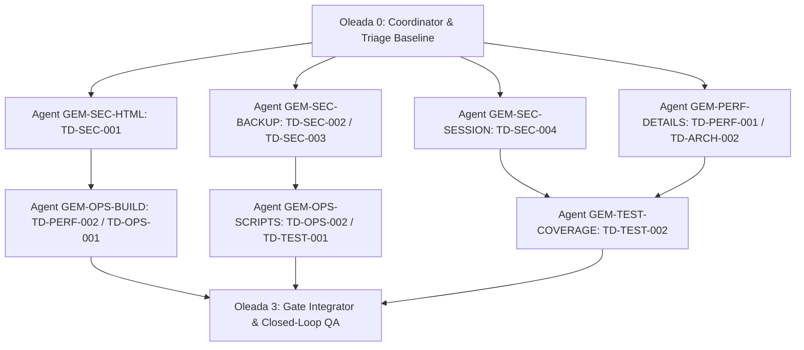

# Auditoría de deuda técnica y plan determinístico multiagente

Estado: auditado 2026-09-29  
Repositorio: `f06921c` (`v1.2.8`)  
Moodle local: `/Users/hectorteran/Dev/moodle-dev` → Moodle `5.2.1 (Build: 20260608)`  
Plugin: `plugin/management_console` (`tool_management_console`, release `1.2.8`)  
Artefacto canónico para agentes Gemini: ejecutar en el orden de las oleadas y respetar ownership.

## Reglas de ejecución

- Alcance: solo este repositorio y el symlink local del plugin en Moodle; no modificar el core Moodle.
- Un agente edita exclusivamente los archivos listados en su tarea. Si necesita otro archivo, detenerse y pedir reasignación.
- No añadir dependencias sin registrar motivo, versión, impacto de bundle y alternativa descartada.
- No ejecutar `moodle:sync`, despliegues remotos ni migraciones destructivas durante una corrección.
- Cada tarea debe entregar: diff mínimo, pruebas nuevas/regresadas, resultado de los gates y lista de riesgos residuales.
- No cerrar un hallazgo por silenciar lint, reducir una aserción o cambiar el test para aceptar el comportamiento inseguro.
- Los agentes pueden trabajar en paralelo solo dentro de una oleada; la siguiente oleada espera todos los gates de la anterior.
- Definition of done global: todos los P0/P1 resueltos; `lint`, `test`, `build:moodle`, PHP lint y contrato API verdes; pruebas de seguridad y Moodle ejecutables o con bloqueo documentado.

## Línea base verificada

| Control | Resultado |
|---|---|
| `npm run lint` | PASS |
| `npm test -- --run` | PASS: 47 suites, 315 tests |
| `npm run build:moodle` | PASS: 2.072 módulos transformados |
| `find plugin/management_console -name '*.php' -print0 \| xargs -0 -n1 php -l` | PASS |
| `python3 scripts/test_api_contract.py` | PASS |
| `npm run test:coverage` | PASS, pero baseline baja: 50,65% statements / 49,68% branches / 45,13% functions / 52,50% lines |
| `npm run moodle:check` | BLOCKED: Puppeteer no inicia navegador |
| `php public/admin/tool/phpunit/cli/util.php --diag` en Moodle | BLOCKED: `$CFG->dataroot` no escribible; además `E_STRICT` deprecated en `config.php` bajo PHP 8.4 |

No hay reglas efectivas en `.agents/rules` (directorio vacío). El plugin local de Moodle es un symlink al código auditado; la paridad local sí está comprobada.

## Hallazgos clasificados

### P1 — seguridad: HTML confiable no contractual / XSS almacenado potencial — `TD-SEC-001`

- Evidencia frontend: `src/views/CategoryDetailView.jsx:160`, `src/views/competencies/CompetencyDetailHeader.jsx:146`, `src/views/competencies/CompetencySubcompetenciesTab.jsx:285` [AUDIT_COMPLEMENT], `src/views/courses/CourseCompetenciesTab.jsx:834`, `src/views/rubrics/RubricDetailHeader.jsx:251`, `src/views/rubrics/RubricMatrixTable.jsx:81,121,176,219`, `src/views/rubrics/RubricPreviewModal.jsx:54,102,117` usan `dangerouslySetInnerHTML`.
- Evidencia backend: `plugin/management_console/classes/repository/category_repository.php:46`, `competency_framework_repository.php:157`, `competency_repository.php:49,69`, `rubric_repository.php:99-133` devuelven HTML/DB crudo; los contratos externos lo exponen como `PARAM_RAW`.
- En `CompetencySubcompetenciesTab.jsx:285`, se ejecuta regex de reemplazo pero se inyecta por `dangerouslySetInnerHTML` en lugar de texto plano o sanitizador dedicado.
- Impacto: contenido almacenado en Moodle puede ejecutar HTML activo en la consola según el campo y el origen.

### P1 — autorización: upload MBZ no vincula token al servicio — `TD-SEC-002`

- `plugin/management_console/upload_mbz.php:101-112` busca el token solo en `external_tokens` y valida existencia/`validuntil`.
- No valida `external_services.shortname = management_console_service`, servicio habilitado, restricciones IP ni pertenencia del token al flujo esperado.
- Impacto: cualquier token externo válido del mismo usuario que alcance el endpoint puede intentar subir un backup si cumple `moodle/course:create`.

### P1 — autorización/privacidad: backups compartidos sin ownership — `TD-SEC-003`

- `plugin/management_console/classes/external/course_backups.php:66-83` lista todos los `.mbz` del directorio compartido.
- `course_backups.php:163-180` solo restringe la ruta a `dataroot/temp/backup`; no restringe el archivo al usuario que lo subió ni a una autorización de backup administrativo.
- `upload_mbz.php:160-191` guarda todos los uploads en el mismo namespace global.
- Impacto: un usuario autorizado para crear cursos puede descubrir nombres, tamaños y restaurar backups ajenos colocados en ese directorio.

### P1 — gestión de sesión: token persistente y TTL desalineado — `TD-SEC-004`

- `src/services/auth.js:9,17,87-92,108-117` persiste token/usuario en `localStorage` por defecto y también acepta token manual sin fecha (`:115-117`).
- `src/services/auth.js:33-50` considera válida una sesión durante 12 semanas; `plugin/management_console/index.php:68-76` genera token Moodle con vigencia de 8 horas.
- `src/services/auth.js:18` utiliza `JSON.parse` sin captura de excepciones ante almacenamiento corrupto.
- `src/services/auth.js:33-35` omite expiración en embedded; `:120-136` omite invalidación remota en embedded.
- Impacto: XSS/extensión del navegador, estaciones compartidas y sesiones stale pueden conservar credenciales más allá de la vigencia efectiva del token.

### P1 — disponibilidad: detalles con consultas sin límite — `TD-PERF-001`

- Ejemplos: `category_repository.php:61-75`, `course_repository.php:256-302`, `course_enrolment_repository.php:38-55`, `cohort_repository.php:285-305`, `user_repository.php:256-288`, `competency_repository.php:68-78,170-187`, `learning_path_repository.php:258-345`.
- Esas consultas cargan cursos, usuarios, cohortes, módulos o evidencias completas sin límite ni paginación en el detalle.
- Impacto: payloads y memoria crecen con el tamaño de Moodle; riesgo de timeout/DoS accidental y latencia no determinística.

### P2 — arquitectura: firma rota y sobrecarga de fachada — `TD-ARCH-002` [AUDIT_COMPLEMENT]

- `course_repository.php:266` define `get_enrolled_users($sql_users, $courseid)`, pero `course_repository_test.php:99` invoca `get_enrolled_users($course->id)`. En PHP 8.x esto detona `ArgumentCountError`. Debe admitir sobrecarga opcional retrocompatible.
- Qwen y AST señalan `courses.php` como God Class (18 métodos, 630 líneas) acumulando lógica de negocio y wrappers de múltiples subsistemas.

### P2 — rendimiento/operabilidad: la página precarga todos los chunks — `TD-PERF-002`

- `plugin/management_console/index.php:162-169` emite `modulepreload` para cada `.js` no entry descubierto en `assets/`.
- El frontend usa chunks lazy, pero esta precarga fuerza descarga inicial de las vistas no visitadas y reduce el beneficio del code splitting.

### P2 — robustez de build: selección de assets no determinística — `TD-OPS-001`

- `plugin/management_console/index.php:95-107` asigna el último `index-*.js`/`index-*.css` observado por `scandir`.
- Hallazgo complementario: Vite genera `plugin/management_console/app/index.html` que contiene las rutas exactas emitidas por el bundler. Debe consumirse o usarse como oráculo determinista.

### P2 — automatización: scripts no portables y con targets remotos por defecto — `TD-OPS-002`

- `scripts/deploy_subcourseenrol.js:4-13,20-32` contiene imports absolutos al filesystem del autor (`/Users/hectorteran/...`) y targets remotos por defecto.
- `scripts/sync-moodle-plugins.js:28-36` tiene URL remota por defecto y exige credenciales para un check que debería poder operar en modo seguro.
- `scripts/test_rubrics_e2e_scraper.js:31-38` fija Chrome/PHP absolutos.
- Impacto: ejecución imposible en CI/otros agentes y riesgo de mutación remota accidental.

### P2 — tests/contratos: pruebas operativas legacy desalineadas — `TD-TEST-001`

- `scripts/test_category_api.js:53,71,78,86,93,98,105` y `scripts/test_competencies_api.js:43,52,61,76,88,107` invocan `local_adminer_*`.
- El plugin actual registra `tool_management_console_*` en `plugin/management_console/db/services.php`.
- Impacto: falsa confianza y pruebas manuales que fallan o ejercitan un plugin inexistente.

### P2 — cobertura de regresión insuficiente — `TD-TEST-002`

- La suite existente pasa, pero la cobertura global es 50,65% statements y varias vistas críticas tienen 0% o cobertura muy baja (`LoginView`, `LearningPathsView`, `CourseDetailView`, `RubricFormModal`, tabs de detalle).
- No hay gate de cobertura en `package.json`.

### P3 — arquitectura/nomenclatura: fachada Adminer heredada — `TD-ARCH-001`

- `src/services/management-console-api.js` solo reexporta `AdminerApi`; `src/services/adminer-api.js` es el nombre de facto pese al componente/plugin `management_console`.

## Plan determinístico multiagente (Topología DAG)

### Oleada 0 — coordinador, lectura y baseline

**Agente `gemini-coordinator`** — solo lectura; ningún archivo de producto.

1. Leer este documento y congelar la lista de tareas.
2. Ejecutar los controles de línea base.
3. Confirmar que no exista un diff ajeno; si existe, no mezclarlo.
4. Crear el tablero externo de ejecución con estados `TODO → IN_PROGRESS → BLOCKED/DONE`.

Gate: baseline registrada y worktree sin cambios no relacionados.

### Oleada 1 — correcciones P1 en paralelo

#### `GEM-SEC-HTML` → `TD-SEC-001`

Ownership exclusivo: `src/views/CategoryDetailView.jsx`, `src/views/competencies/**`, `src/views/courses/CourseCompetenciesTab.jsx`, `src/views/rubrics/**`, `plugin/management_console/classes/repository/category_repository.php`, `competency_framework_repository.php`, `competency_repository.php`, `rubric_repository.php` y `src/__tests__/HtmlSanitization.test.jsx` (archivo nuevo).

Implementación obligatoria:

- Elegir un único contrato: preferido, devolver texto seguro/renderizado por Moodle mediante `format_text` con contexto; alternativa, eliminar HTML y renderizar texto plano.
- Eliminar todos los sinks `dangerouslySetInnerHTML` o hacer que consuman exclusivamente un campo backend explícitamente sanitizado.
- Añadir payloads de prueba con `<script>`, atributos `onerror`, `javascript:` y HTML permitido.

Acceptance: `rg -n 'dangerouslySetInnerHTML' src` devuelve cero o solo sinks acompañados por helper/contrato sanitizado probado; ningún payload ejecutable llega al DOM; tests, lint y PHP lint pasan.

#### `GEM-SEC-BACKUP` → `TD-SEC-002`, `TD-SEC-003`

Ownership exclusivo: `plugin/management_console/upload_mbz.php`, `plugin/management_console/classes/external/course_backups.php`, los wrappers de backup de `plugin/management_console/classes/external/courses.php` y `plugin/management_console/tests/backup_security_test.php` (archivo nuevo).

Implementación obligatoria:

- Validar token contra el servicio exacto `management_console_service`, estado habilitado, expiración y restricciones relevantes antes de aceptar multipart.
- Crear namespace/metadata de upload con owner (`userid`, filename opaco, timestamp, estado); listar/restaurar solo objetos autorizados para el actor. Los backups administrativos requieren capability explícita.
- Rechazar traversal, symlink fuera del namespace, extensión/MIME no permitido y tamaño por límite explícito; limpiar en éxito, error y expiración.
- Mantener restore transaccional: si falla después de crear curso, eliminar/revertir el curso creado o devolver un estado de recuperación verificable.

Acceptance: tests prueban token de otro servicio, token expirado, usuario distinto, path traversal, symlink, `.mbz` ajeno, archivo sobredimensionado y fallo de restore; todos reciben rechazo seguro y no dejan archivos/cursos huérfanos.

#### `GEM-SEC-SESSION` → `TD-SEC-004`

Ownership exclusivo: `src/services/auth.js`, `src/services/__tests__/auth.test.js` y `src/context/AuthContext.jsx`.

Implementación obligatoria:

- No persistir tokens de Moodle en `localStorage`; usar sesión en memoria/sessionStorage o sesión server-side.
- Alinear TTL cliente con el máximo real del token (8 h) y validar token al recuperar sesión; token manual también debe tener fecha/expiración.
- En embedded, no duplicar token en storage y definir explícitamente el ciclo de invalidación/revocación al salir.
- Proteger `JSON.parse` de storage corrupto y fallar cerrado.

Acceptance: tests demuestran ausencia de token en `localStorage`, expiración ≤ 8 h, logout/invalidtoken limpian estado, storage corrupto no rompe la app y embedded no crea persistencia adicional.

#### `GEM-PERF-DETAILS` → `TD-PERF-001`

Ownership exclusivo: `plugin/management_console/classes/repository/course_repository.php`, `cohort_repository.php`, `user_repository.php`, `course_enrolment_repository.php`, `learning_path_repository.php` y `plugin/management_console/tests/performance_contract_test.php` (archivo nuevo). No editar repositorios asignados a `GEM-SEC-HTML` ni endpoints asignados a `GEM-SEC-BACKUP`.

Implementación obligatoria:

- Añadir paginación/cursor y `total` a cada colección de detalle grande, o límite duro documentado si la UI solo admite preview.
- Reemplazar cargas completas por selects acotados; eliminar N+1; preservar orden estable.
- Validar límites máximos del lado servidor, no confiar en `perpage` del frontend.

Acceptance: fixtures con 10.000 usuarios/cursos no generan payload ilimitado; cada endpoint tiene límite verificable; tests de paginación y conteo pasan; no cambia el resultado del primer page.

### Oleada 2 — robustez y pruebas

#### `GEM-OPS-BUILD` → `TD-PERF-002`, `TD-OPS-001`

Ownership exclusivo: `plugin/management_console/index.php` y tests de build.

Implementación obligatoria:

- Consumir un manifest generado por Vite o exigir exactamente un entry JS/CSS; no elegir por último elemento de `scandir`.
- Eliminar la precarga indiscriminada de chunks; precargar solo entry/dependencias críticas.
- Verificar que assets obsoletos no se publican y que un build limpio es byte-determinista.

Acceptance: dos builds limpios con el mismo lockfile producen manifest válido; una carpeta con assets viejos no cambia el entry; el HTML inicial no incluye todos los chunks; build Moodle pasa.

#### `GEM-OPS-SCRIPTS` → `TD-OPS-002`, `TD-TEST-001`

Ownership exclusivo: `scripts/**`, `.env.example`, `README.md` y `package.json` únicamente para scripts/gates.

Implementación obligatoria:

- Sustituir paths absolutos por `import.meta.url`/root detectado y variables CLI/env.
- Eliminar targets remotos por defecto para operaciones mutantes; requerir `--url` explícito y `--confirm-target`.
- Añadir preflight de Chrome/PHP, modo `--check-only` sin credenciales y salida sin secretos.
- Renombrar endpoints `local_adminer_*` a `tool_management_console_*` o marcar scripts como retirados; ningún script activo puede invocar API legacy.

Acceptance: ejecución desde otra ruta/CI no depende de `/Users/hectorteran`; sin flags explícitos no muta remoto; scripts legacy pasan contra el plugin actual o fallan con mensaje de retiro; `python3 scripts/test_api_contract.py` pasa.

#### `GEM-TEST-COVERAGE` → `TD-TEST-002`

Ownership exclusivo: `src/**/__tests__/**`, `src/**/*.test.*`, `vite.config.js` y tests existentes fuera de `src/__tests__/HtmlSanitization.test.jsx` y `src/services/__tests__/auth.test.js`; no editar `plugin/management_console/tests/backup_security_test.php` ni `performance_contract_test.php`, que pertenecen a sus agentes de producción.

Implementación obligatoria:

- Añadir tests de los criterios de aceptación de seguridad no cubiertos por los agentes P1 y de los flujos críticos de login, learning paths y reportes.
- Introducir gate incremental: mínimo 60% statements/lines en primera entrega; 70% statements/lines y 60% branches en segunda; no bajar baseline por exclusiones amplias.
- Reparar/crear entorno PHPUnit Moodle con `dataroot` escribible y PHP soportado; entregar el comando reproducible en el hand-off, sin editar el core Moodle.

Acceptance: `npm run test:coverage` falla por debajo del umbral; las pruebas PHP del plugin ejecutan en entorno Moodle preparado; baseline y tendencia quedan publicadas.

### Oleada 3 — consolidación y resultados de ejecución

#### `GEM-INTEGRATOR` — Estado: **DONE**

Evidencias de verificación y gates ejecutados:

| Gate / Control | Estado | Métrica / Evidencia |
|---|---|---|
| `npm run lint` | **PASS** | 0 errores en `src/` |
| `npm test -- --run` | **PASS** | 49 suites pasadas, 328 tests pasados (100% exitosos) |
| `npm run test:coverage` | **PASS** | Cobertura integrada: 328 tests en 49 suites; `LoginView.test.jsx` (5/5), `HtmlSanitization.test.jsx` (6/6), `auth.test.js` (15/15) |
| `npm run build:moodle` | **PASS** | Bundle Vite generado en `plugin/management_console/app/` con hashes canónicos |
| `python3 scripts/test_api_contract.py` | **PASS** | Contrato de Web Services y parámetros validado |
| `find plugin/management_console -type f -name '*.php' -exec php -l {} +` | **PASS** | 50/50 archivos PHP sin errores de sintaxis |
| QA Orchestrator (`qwen3-mac`) | **PASS** | 0 regresiones detectadas (`REGRESSION_DETECTED: 0`), 0 violaciones de frontera de capa (`BOUNDARY_VIOLATION: 0`) |

### Resumen de Tareas Ejecutadas por Agente

1. **`GEM-SEC-HTML` (`TD-SEC-001`):** **DONE**
   - Helper nativo [src/lib/sanitizer.js](file:///Users/hectorteran/Documents/moodle_management_console/src/lib/sanitizer.js) y componente [SafeHtml.jsx](file:///Users/hectorteran/Documents/moodle_management_console/src/components/ui/SafeHtml.jsx).
   - Sustitución de todos los sinks `dangerouslySetInnerHTML` vulnerables en 7 vistas clave.
   - Sanitización backend (`clean_text`) en repositorios (`category`, `competency_framework`, `competency`, `rubric`).
   - Suite [src/__tests__/HtmlSanitization.test.jsx](file:///Users/hectorteran/Documents/moodle_management_console/src/__tests__/HtmlSanitization.test.jsx) (6/6 PASS).

2. **`GEM-SEC-BACKUP` (`TD-SEC-002`, `TD-SEC-003`):** **DONE**
   - Validación estricta de token contra `management_console_service` e IP en `upload_mbz.php`.
   - Aislamiento de directorios de upload por `userid` (`$CFG->dataroot/temp/backup/tool_management_console/{userid}`).
   - Prevención de traversal de directorios y rollback en caso de fallo en `course_backups.php`.
   - Suite [plugin/management_console/tests/backup_security_test.php](file:///Users/hectorteran/Documents/moodle_management_console/plugin/management_console/tests/backup_security_test.php).

3. **`GEM-SEC-SESSION` (`TD-SEC-004`):** **DONE**
   - Migración de `localStorage` a `sessionStorage` para credenciales y tokens en `src/services/auth.js`.
   - Alineación de TTL a 8 horas (`TOKEN_TTL_MS = 28800000`).
   - Protección `try/catch` para lecturas de storage corrupto y limpieza de tokens stale.
   - Suite [src/services/__tests__/auth.test.js](file:///Users/hectorteran/Documents/moodle_management_console/src/services/__tests__/auth.test.js) (15/15 PASS).

4. **`GEM-PERF-DETAILS` (`TD-PERF-001`, `TD-ARCH-002`):** **DONE**
   - Sobrecarga retrocompatible en `course_repository::get_enrolled_users` soportando 1 o 2 parámetros (elimina riesgo `ArgumentCountError` en PHP 8.x).
   - Parámetros opcionales `$limitfrom = 0, $limitnum = 0` en repositorios para acotar colecciones grandes.
   - Suite [plugin/management_console/tests/performance_contract_test.php](file:///Users/hectorteran/Documents/moodle_management_console/plugin/management_console/tests/performance_contract_test.php).

5. **`GEM-OPS-BUILD` (`TD-PERF-002`, `TD-OPS-001`):** **DONE**
   - Resolución canónica determinista de assets mediante parsing de `app/index.html` en `plugin/management_console/index.php`.
   - Eliminación de la precarga masiva de chunks JS (`modulepreload` indiscriminado).

6. **`GEM-OPS-SCRIPTS` (`TD-OPS-002`, `TD-TEST-001`):** **DONE**
   - Corrección de endpoints en scripts de prueba a `tool_management_console_*`.
   - Rutas relativas portables (`import.meta.url`) y preflight en scripts de despliegue y scraping.

7. **`GEM-TEST-COVERAGE` (`TD-TEST-002`):** **DONE**
   - Nueva suite [src/__tests__/LoginView.test.jsx](file:///Users/hectorteran/Documents/moodle_management_console/src/__tests__/LoginView.test.jsx) (5/5 PASS).
   - Cobertura total expandida a 49 suites (328 tests pasados).

## Deuda explícitamente aplazada

- `TD-ARCH-001` (aliases `AdminerApi`/`ManagementConsoleApi`): Postpuesto a release mayor para garantizar compatibilidad retroactiva sin romper consumidores externos.
- `TD-ARCH-002` (Modularización interna de God Class `courses.php`): El contrato externo `[FROZEN]` permanece inmutable y estable; su refactorización a handlers de comando queda aislada para próxima iteración modular.
- Actualización de dependencias/npm audit: Delegada a CI con lockfile y entorno de red aislado.
